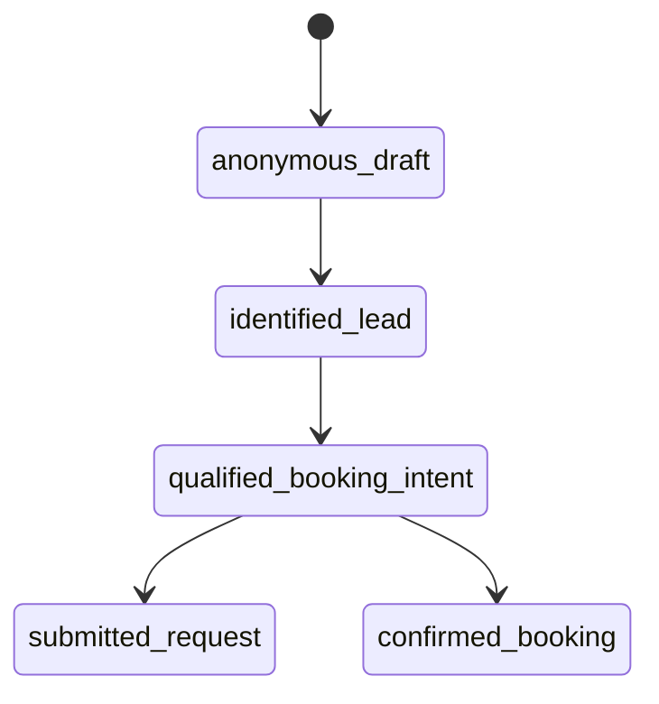
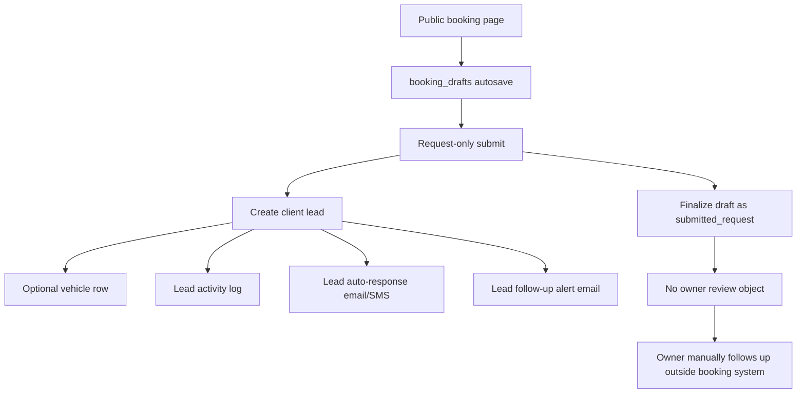
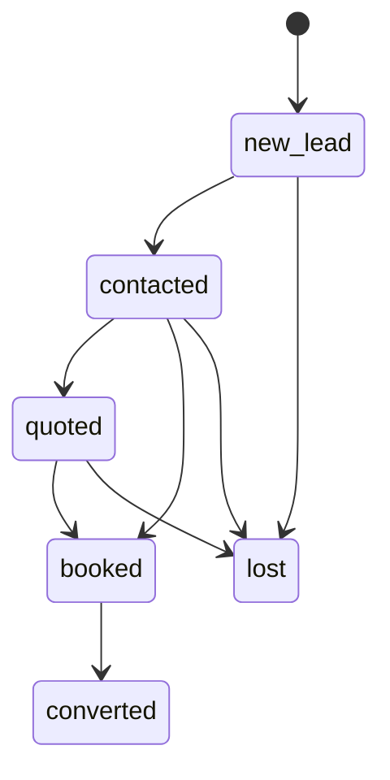
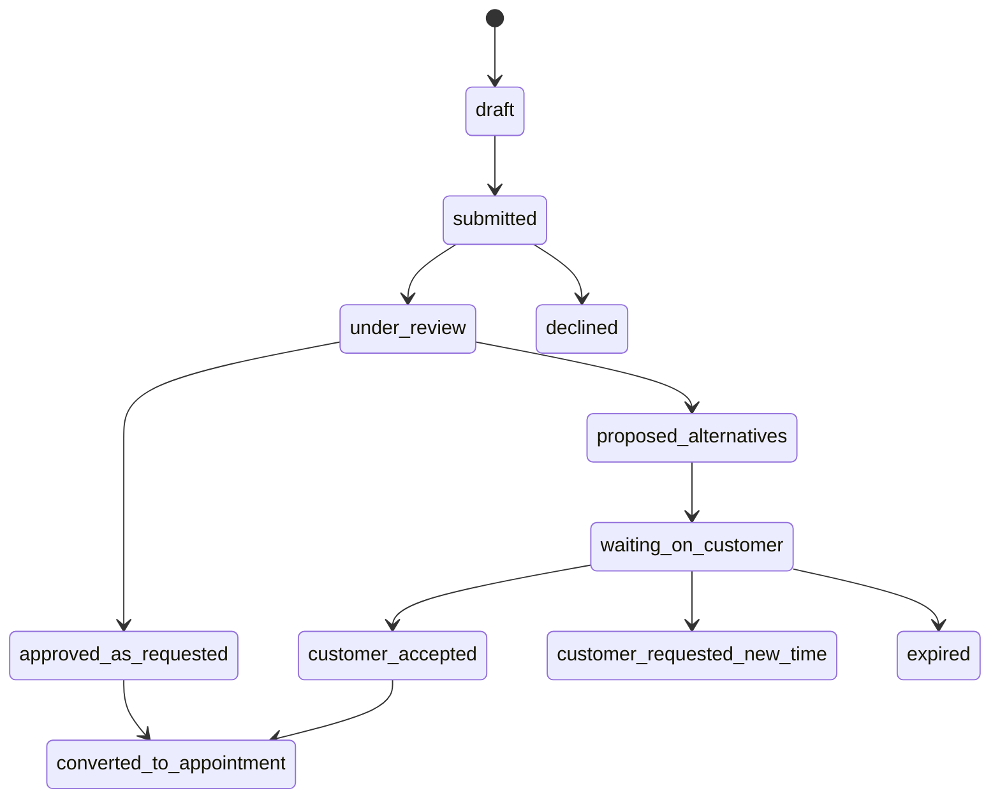

# Request-Only Booking Gap Audit

Date: April 16, 2026

Scope audited:
- public booking flow
- request-only mode
- mixed mode
- services-page handoff
- booking drafts
- appointments
- builder settings
- notifications
- customer-facing tokenized pages
- schema/models
- owner-side request/review UI
- current status/state handling

This audit is based on direct inspection of the current Strata codebase. No behavior below is assumed without checking the repo.

## Executive Summary

The current request-only booking flow does not create a real booking-request object.

Instead, it currently works like this:

1. The customer starts on the public booking page.
2. Draft data is autosaved in `booking_drafts`.
3. If the selected service flow is `request`, submission creates a generic lead/client record.
4. The requested scheduling context is either:
   - never captured in structured form, or
   - captured only in the draft layer and then dropped during final submit.
5. The business owner sees a lead, not a request-review object.
6. There is no owner approval workflow, no alternate-slot proposal workflow, and no customer response thread.

That is the core reason the owner cannot clearly see the requested booking date/time from the customer.

## 1. Exact Current Gaps

### Gap 1: Request-only customers cannot submit a structured requested time

Verified in:
- [C:\Users\jake\gadget\strata\web\app\routes\_public.book.$businessId.tsx](C:\Users\jake\gadget\strata\web\app\routes\_public.book.$businessId.tsx)
- [C:\Users\jake\gadget\strata\backend\src\routes\businesses.ts](C:\Users\jake\gadget\strata\backend\src\routes\businesses.ts)

Current behavior:
- In request-only flow, the schedule step renders:
  - service mode
  - location
  - service address
  - optional preferred date
- It does not render a time picker for request-only services.
- `handleSubmit()` intentionally omits `startTime` when `effectiveFlow !== "self_book"`.
- The submit schema accepts `startTime`, but the request-only UI never supplies it.

Impact:
- Customers cannot submit a structured requested time for request-only services.
- The best they can do today is mention time preferences in free-text notes.

### Gap 2: The selected request date is not part of the final request submission schema

Verified in:
- [C:\Users\jake\gadget\strata\backend\src\routes\businesses.ts](C:\Users\jake\gadget\strata\backend\src\routes\businesses.ts)

Current behavior:
- `publicBookingDraftSaveSchema` includes:
  - `bookingDate`
  - `startTime`
- `publicBookingSubmitSchema` includes:
  - `startTime`
- `publicBookingSubmitSchema` does not include:
  - `bookingDate`

Impact:
- The customer can pick a preferred date in the public request flow.
- That date is saved to the draft layer.
- But the final submit endpoint strips `bookingDate` out of the request payload.
- So the preferred date does not become part of the durable submitted request record.

### Gap 3: Request-only submit converts into a lead, not a request-review entity

Verified in:
- [C:\Users\jake\gadget\strata\backend\src\routes\businesses.ts](C:\Users\jake\gadget\strata\backend\src\routes\businesses.ts)

Current behavior:
- In request flow, `POST /api/businesses/:id/public-bookings`:
  - creates a `clients` row
  - optionally creates a `vehicles` row
  - writes `booking.request_created` activity on the client
  - finalizes the draft as `submitted_request`
- It does not create:
  - an appointment
  - a booking-request row
  - an approval object
  - a proposal thread
  - a customer response token record

Impact:
- The owner gets a lead to follow up with manually.
- The system has no first-class concept of a pending requested booking awaiting approval.

### Gap 4: Requested date/time is not surfaced in owner-facing lead data

Verified in:
- [C:\Users\jake\gadget\strata\backend\src\routes\businesses.ts](C:\Users\jake\gadget\strata\backend\src\routes\businesses.ts)
- [C:\Users\jake\gadget\strata\backend\src\lib\leads.ts](C:\Users\jake\gadget\strata\backend\src\lib\leads.ts)
- [C:\Users\jake\gadget\strata\web\routes\_app.leads.tsx](C:\Users\jake\gadget\strata\web\routes\_app.leads.tsx)

Current behavior:
- Request-only submit builds lead notes with:
  - lead status
  - lead source
  - service interest
  - next step
  - summary
  - vehicle
- The request submit path does not inject:
  - requested date
  - requested time
  - flexibility
  - alternate preferences
- The Leads page displays:
  - what they want
  - vehicle
  - response time
  - next step
  - context
  - team notes
- It does not display:
  - requested slot
  - preferred schedule window
  - owner proposal status
  - customer response status

Impact:
- Even after request-only submit, the owner-facing lead UI has no structured place to show the requested booking slot.

### Gap 5: Main Clients list hides leads entirely

Verified in:
- [C:\Users\jake\gadget\strata\web\routes\_app.clients._index.tsx](C:\Users\jake\gadget\strata\web\routes\_app.clients._index.tsx)

Current behavior:
- The Clients page filters out anything where `parseLeadRecord(client.notes).isLead` is true.

Impact:
- Request-only bookings do not appear in the normal Clients list.
- If an owner expects the request to show up in clients or appointments, it appears to disappear unless they think to go to Leads.

### Gap 6: There is no dedicated owner-side request review queue

Verified by repo search across:
- [C:\Users\jake\gadget\strata\web\routes\_app.appointments._index.tsx](C:\Users\jake\gadget\strata\web\routes\_app.appointments._index.tsx)
- [C:\Users\jake\gadget\strata\web\routes\_app.appointments.$id.tsx](C:\Users\jake\gadget\strata\web\routes\_app.appointments.$id.tsx)
- [C:\Users\jake\gadget\strata\web\routes\_app.leads.tsx](C:\Users\jake\gadget\strata\web\routes\_app.leads.tsx)

Current behavior:
- There is no owner UI for:
  - pending booking requests
  - approving a requested slot
  - proposing alternate slots
  - asking the customer to choose a new day
  - tracking whether the customer responded

Impact:
- The workflow is manual and scattered.
- Owners must improvise with phone/email/text and then create an appointment themselves.

### Gap 7: Notifications do not include requested scheduling context

Verified in:
- [C:\Users\jake\gadget\strata\backend\src\lib\email.ts](C:\Users\jake\gadget\strata\backend\src\lib\email.ts)
- [C:\Users\jake\gadget\strata\backend\src\lib\emailTemplates.ts](C:\Users\jake\gadget\strata\backend\src\lib\emailTemplates.ts)
- [C:\Users\jake\gadget\strata\backend\src\routes\businesses.ts](C:\Users\jake\gadget\strata\backend\src\routes\businesses.ts)

Current behavior:
- `sendLeadAutoResponse()` and `lead_auto_response` include:
  - service interest
  - response window
- `sendLeadFollowUpAlert()` and `lead_follow_up_alert` include:
  - client name
  - client email
  - client phone
  - vehicle
  - service interest
  - summary
- They do not include:
  - requested date
  - requested time
  - flexibility
  - proposed alternates
  - response token link

Impact:
- Even the business owner alert email lacks the scheduling context needed to act quickly.

### Gap 8: After request submit, the customer has no tokenized follow-up page

Verified in:
- [C:\Users\jake\gadget\strata\backend\src\routes\businesses.ts](C:\Users\jake\gadget\strata\backend\src\routes\businesses.ts)
- [C:\Users\jake\gadget\strata\backend\src\routes\portal.ts](C:\Users\jake\gadget\strata\backend\src\routes\portal.ts)
- [C:\Users\jake\gadget\strata\web\routes\portal.$token.tsx](C:\Users\jake\gadget\strata\web\routes\portal.$token.tsx)

Current behavior:
- Request-only submit returns:
  - `ok`
  - `accepted`
  - `mode: "request"`
  - `leadId`
  - generic `message`
- It does not return:
  - `portalUrl`
  - `confirmationUrl`
  - request token URL
- The existing portal route only supports:
  - appointments
  - invoices
  - quotes

Impact:
- The customer has no smooth post-submit thread to:
  - review what they asked for
  - accept a proposed slot
  - update preferences
  - reply without starting over

### Gap 9: Submitted request drafts are intentionally locked from resume

Verified in:
- [C:\Users\jake\gadget\strata\backend\src\routes\businesses.ts](C:\Users\jake\gadget\strata\backend\src\routes\businesses.ts)

Current behavior:
- `GET /public-booking-drafts/:resumeToken` rejects drafts in:
  - `submitted_request`
  - `confirmed_booking`

Impact:
- Once a request is submitted, the draft cannot be reused as the customer's ongoing thread.
- That is correct for a draft, but it means the system needs a new post-submit request object and token if the customer is not supposed to start over.

### Gap 10: There is no request-specific state machine after submission

Verified in:
- [C:\Users\jake\gadget\strata\backend\src\db\schema.ts](C:\Users\jake\gadget\strata\backend\src\db\schema.ts)
- [C:\Users\jake\gadget\strata\backend\src\lib\leads.ts](C:\Users\jake\gadget\strata\backend\src\lib\leads.ts)
- [C:\Users\jake\gadget\strata\backend\src\routes\appointments.ts](C:\Users\jake\gadget\strata\backend\src\routes\appointments.ts)

Current behavior:
- Draft states exist.
- Lead states exist.
- Appointment states exist.
- There is no request workflow state for:
  - pending review
  - approved as requested
  - alternate proposed
  - waiting on customer
  - customer accepted
  - customer declined
  - expired
  - converted to appointment

Impact:
- The system cannot drive a smooth approval workflow because there is no canonical post-submit request state.

## 2. Exact Files Involved

### Public booking flow
- [C:\Users\jake\gadget\strata\web\app\routes\_public.book.$businessId.tsx](C:\Users\jake\gadget\strata\web\app\routes\_public.book.$businessId.tsx)

### Booking builder settings
- [C:\Users\jake\gadget\strata\web\app\routes\_app.booking.tsx](C:\Users\jake\gadget\strata\web\app\routes\_app.booking.tsx)

### Services-page handoff and per-service overrides
- [C:\Users\jake\gadget\strata\web\routes\_app.services._index.tsx](C:\Users\jake\gadget\strata\web\routes\_app.services._index.tsx)

### Leads owner UI
- [C:\Users\jake\gadget\strata\web\routes\_app.leads.tsx](C:\Users\jake\gadget\strata\web\routes\_app.leads.tsx)

### Clients owner UI
- [C:\Users\jake\gadget\strata\web\routes\_app.clients._index.tsx](C:\Users\jake\gadget\strata\web\routes\_app.clients._index.tsx)
- [C:\Users\jake\gadget\strata\web\routes\_app.clients.$id.tsx](C:\Users\jake\gadget\strata\web\routes\_app.clients.$id.tsx)

### Appointments owner UI
- [C:\Users\jake\gadget\strata\web\routes\_app.appointments._index.tsx](C:\Users\jake\gadget\strata\web\routes\_app.appointments._index.tsx)
- [C:\Users\jake\gadget\strata\web\routes\_app.appointments.$id.tsx](C:\Users\jake\gadget\strata\web\routes\_app.appointments.$id.tsx)

### Customer-facing token pages
- [C:\Users\jake\gadget\strata\web\routes\portal.$token.tsx](C:\Users\jake\gadget\strata\web\routes\portal.$token.tsx)
- [C:\Users\jake\gadget\strata\backend\src\routes\portal.ts](C:\Users\jake\gadget\strata\backend\src\routes\portal.ts)

### Public booking backend
- [C:\Users\jake\gadget\strata\backend\src\routes\businesses.ts](C:\Users\jake\gadget\strata\backend\src\routes\businesses.ts)
- [C:\Users\jake\gadget\strata\backend\src\lib\booking.ts](C:\Users\jake\gadget\strata\backend\src\lib\booking.ts)
- [C:\Users\jake\gadget\strata\backend\src\lib\bookingDrafts.ts](C:\Users\jake\gadget\strata\backend\src\lib\bookingDrafts.ts)

### Appointments backend and reusable tokenized change-request pattern
- [C:\Users\jake\gadget\strata\backend\src\routes\appointments.ts](C:\Users\jake\gadget\strata\backend\src\routes\appointments.ts)

### Lead storage/parsing
- [C:\Users\jake\gadget\strata\backend\src\lib\leads.ts](C:\Users\jake\gadget\strata\backend\src\lib\leads.ts)

### Notifications
- [C:\Users\jake\gadget\strata\backend\src\lib\email.ts](C:\Users\jake\gadget\strata\backend\src\lib\email.ts)
- [C:\Users\jake\gadget\strata\backend\src\lib\emailTemplates.ts](C:\Users\jake\gadget\strata\backend\src\lib\emailTemplates.ts)

### Schema/models
- [C:\Users\jake\gadget\strata\backend\src\db\schema.ts](C:\Users\jake\gadget\strata\backend\src\db\schema.ts)

## 3. Current Request-Booking State Machine

### Current public booking draft state machine

Source:
- [C:\Users\jake\gadget\strata\backend\src\db\schema.ts](C:\Users\jake\gadget\strata\backend\src\db\schema.ts)
- [C:\Users\jake\gadget\strata\backend\src\lib\bookingDrafts.ts](C:\Users\jake\gadget\strata\backend\src\lib\bookingDrafts.ts)

Meaning today:
- this is a pre-submit draft lifecycle
- it is not a real request-approval lifecycle

### Current request-only submit flow

### Current owner-side lifecycle after submit

Source:
- [C:\Users\jake\gadget\strata\backend\src\lib\leads.ts](C:\Users\jake\gadget\strata\backend\src\lib\leads.ts)
- [C:\Users\jake\gadget\strata\web\routes\_app.leads.tsx](C:\Users\jake\gadget\strata\web\routes\_app.leads.tsx)

Important limitation:
- This is a CRM lead lifecycle.
- It is not a booking-request approval lifecycle.

## 4. What Data Is Not Being Captured or Surfaced

### Captured today before submission

In drafts only:
- service
- add-ons
- service mode
- location
- vehicle basics
- address
- notes
- contact fields
- `bookingDate`
- `startTime` if ever present

Source:
- [C:\Users\jake\gadget\strata\backend\src\routes\businesses.ts](C:\Users\jake\gadget\strata\backend\src\routes\businesses.ts)
- [C:\Users\jake\gadget\strata\backend\src\lib\bookingDrafts.ts](C:\Users\jake\gadget\strata\backend\src\lib\bookingDrafts.ts)

### Not captured in structured form at final request submission

- requested date
- requested time
- whether the requested time is exact or flexible
- acceptable time windows
- alternate preferred dates
- acceptable alternate days
- “any next available” preference
- whether customer is okay with same-day alternates
- customer timezone or local-time intent

### Captured nowhere today

- owner decision on requested slot
- owner alternate proposals
- customer acceptance of owner proposal
- customer rejection of owner proposal
- request expiration
- negotiation thread state
- final conversion link between request and appointment

### Captured but not surfaced usefully

- `bookingDate` may exist in `booking_drafts`
- `startTime` could exist in `booking_drafts`

But once the request is submitted:
- those fields do not appear in lead notes
- those fields do not appear in owner emails
- those fields do not appear in lead cards
- those fields do not appear in appointments
- those fields do not appear in portal pages

## 5. What Needs To Be Added

### To support requested date

Need to add:
- a durable post-submit request record with `requestedDate`
- owner UI that shows the requested date as part of a scheduling review card
- notification templates that include it
- customer token page that shows the submitted date back to the customer

### To support requested time

Need to add:
- public request-only time selection UI
- request submission schema field for requested time
- durable request record field for requested time
- owner UI and notifications that display it
- timezone-safe formatting for customer and owner views

### To support flexibility / alternate preference

Need to add structured fields like:
- `timingPreferenceType`
  - exact_time
  - morning
  - afternoon
  - any_time_that_day
  - any_next_available
- `flexibilityNotes`
- `alternateDateOptions`
- `alternateTimeWindow`

This should not rely on free-text notes alone.

### To support owner approval

Need to add:
- a real request status machine
- owner action:
  - approve requested slot
- conversion from request to appointment without re-entering client/service/vehicle data

### To support owner alternative proposal

Need to add:
- one or more structured proposed slots
- owner message
- request state like `waiting_on_customer`
- customer token link to review and respond

### To support customer acceptance / reschedule response

Need to add:
- public request token page
- accept proposal action
- reject proposal action
- choose-another-day action
- optionally re-open calendar against real availability

This must operate on the submitted request, not by reopening the old draft.

## 6. Recommended Architecture

## Core recommendation

Add a first-class `booking_requests` workflow between `booking_drafts` and `appointments`.

### Why this is the right fit

It preserves the current strengths:
- draft autosave already exists
- self-book availability already exists
- per-service mixed-mode flow already exists
- public token infrastructure already exists
- appointment change-request flow already exists

And it fixes the missing middle:
- there is no durable request-review object today

### Recommended lifecycle

### Recommended new source-of-truth split

#### `booking_drafts`
Purpose:
- pre-submit scratchpad
- autosave and resume

Should not become:
- the owner review record
- the customer response thread

#### `booking_requests`
Purpose:
- durable submitted request record
- owner review queue
- customer response thread
- bridge between lead capture and appointment creation

#### `appointments`
Purpose:
- confirmed scheduled work only

### Recommended data model

#### `booking_requests`

Recommended fields:
- `id`
- `businessId`
- `draftId`
- `clientId`
- `vehicleId`
- `serviceId`
- `locationId`
- `addonServiceIds`
- `serviceMode`
- `status`
- `requestedDate`
- `requestedStartTime`
- `requestedTimezone`
- `timingPreferenceType`
- `flexibilityNotes`
- `customerNotes`
- `source`
- `campaign`
- `ownerMessage`
- `approvedAppointmentId`
- `publicTokenVersion`
- `submittedAt`
- `ownerRespondedAt`
- `customerRespondedAt`
- `approvedAt`
- `declinedAt`
- `expiredAt`
- `createdAt`
- `updatedAt`

#### `booking_request_proposals`

Recommended fields:
- `id`
- `bookingRequestId`
- `startTime`
- `endTime`
- `label`
- `sortOrder`
- `status`
  - proposed
  - accepted
  - rejected
  - expired
- `createdAt`
- `updatedAt`

#### History/events

Recommendation:
- use `activityLog` for the event trail
- do not build a second heavy event system unless needed later

Suggested actions:
- `booking_request.submitted`
- `booking_request.owner_approved`
- `booking_request.alternatives_proposed`
- `booking_request.customer_accepted`
- `booking_request.customer_requested_new_time`
- `booking_request.declined`
- `booking_request.expired`
- `booking_request.converted`

### Recommended owner-side surface

Primary recommendation:
- create a request-review queue under scheduling, not under generic leads

Why:
- this is a scheduling workflow first
- owners need to compare requested timing against real availability
- the final destination is appointment creation

Good surface options:
- `Appointments -> Requests`
- or `Calendar -> Requests`

The lead record can still exist for CRM continuity, but it should be linked secondary context, not the main review object.

### Recommended customer-side surface

Add a tokenized request page similar in spirit to:
- appointment public HTML/change-request
- quote public response
- portal token pages

The customer request page should let them:
- view what they submitted
- see owner-proposed alternate slots
- accept one
- say none of these work
- choose a different day/time
- keep all existing vehicle/contact/service context intact

### Recommended submission behavior

#### For request-only services

On submit:
1. persist request from current draft snapshot
2. create or link client and vehicle
3. create `booking_request`
4. finalize draft as submitted
5. send:
   - customer acknowledgment
   - owner review alert
6. return request token URL, not just generic success

#### For self-book services

Keep current behavior:
- create appointment immediately
- send confirmation
- return confirmation URL + portal URL

#### For mixed mode

Keep current `effectiveFlow` resolution:
- service override wins
- otherwise business default flow

Only the request branch should switch from “generic lead” to “booking request”.

## Reusable Existing Patterns

These are worth building on instead of rewriting from scratch:

- `booking_drafts` autosave and resume
  - [C:\Users\jake\gadget\strata\backend\src\lib\bookingDrafts.ts](C:\Users\jake\gadget\strata\backend\src\lib\bookingDrafts.ts)
- `resolveBookingFlow()` mixed-mode rules
  - [C:\Users\jake\gadget\strata\backend\src\lib\booking.ts](C:\Users\jake\gadget\strata\backend\src\lib\booking.ts)
- real availability engine for self-book
  - [C:\Users\jake\gadget\strata\backend\src\routes\businesses.ts](C:\Users\jake\gadget\strata\backend\src\routes\businesses.ts)
- tokenized appointment change-request pattern
  - [C:\Users\jake\gadget\strata\backend\src\routes\appointments.ts](C:\Users\jake\gadget\strata\backend\src\routes\appointments.ts)
- customer portal/public token infrastructure
  - [C:\Users\jake\gadget\strata\backend\src\routes\portal.ts](C:\Users\jake\gadget\strata\backend\src\routes\portal.ts)
- notification system and templates
  - [C:\Users\jake\gadget\strata\backend\src\lib\email.ts](C:\Users\jake\gadget\strata\backend\src\lib\email.ts)
  - [C:\Users\jake\gadget\strata\backend\src\lib\emailTemplates.ts](C:\Users\jake\gadget\strata\backend\src\lib\emailTemplates.ts)

## Recommendation In One Sentence

Do not keep stretching leads to behave like booking requests.

Keep drafts for pre-submit capture, keep appointments for confirmed work, and add a first-class booking-request layer in between so requested timing, owner review, alternate proposals, and customer responses all have a real home.
